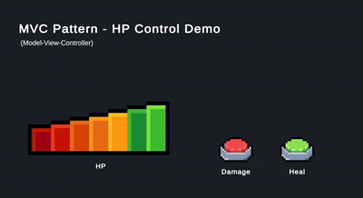

# MVC Pattern – HP Control Demo

간단한 HP UI를 통해 Unity에서 **MVC(Model–View–Controller)** 구조를 구현한 예제입니다.  
버튼 입력 → Model 변경 → View 갱신의 흐름을 명확하게 확인할 수 있습니다.  

---

## 🎮 데모 화면 (Scene Overview)

> Damage / Heal 버튼 입력으로
> Controller가 Model을 변경하고,  
> View를 갱신하는 방식입니다.

---

## 🧩 패턴 구조

**Model (HPStatus)**
- 데이터, 논리
- HP 데이터와 감소/회복 로직을 관리

**View (HPView)**
- HP 텍스트와 이미지(Sprite)를 화면에 표시
- Model을 직접 참조하지 않으며 UI 렌더링만 담당

**Controller (HPController)**
- 버튼 입력 처리
- Model 값 변경 후 View 업데이트 호출

→ **입력 → Controller → Model → Controller → View** 의 전형적인 MVC 흐름을 구현

---

## ▶ 실행 방법
1. `MVC_HpSample.unity` 씬 실행
2. Damage / Heal 버튼 클릭
3. HP 변화가 View(UI)에 반영되는 구조 확인

---

## 💭 회고

MVC 구조는  
Model(게임 로직)과 View(UI)가 분리되어, 역할 별 코드 수정이 용이하다는 장점이 있지만,
Controller가 Model과 View를 모두 관리하기 때문에,  
기능이 늘어날수록 **Controller가 너무 무거워질 것 같다**고 생각했습니다.

---
